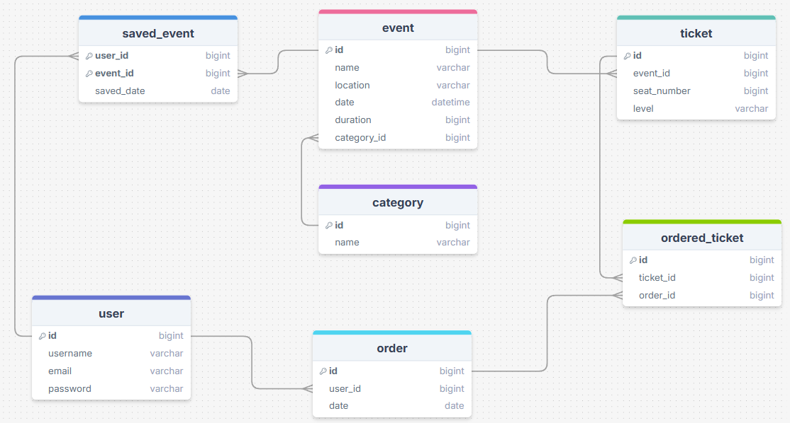

# WhereToNext
An Android app for listing the upcoming events in your city

## Current state:
- created Event, Category and User models
- added DAOs for the models
- added repository classes
- created the database class
- created the singleton ApplicationController and instantiated the database there

## Next steps:
- create the rest of the models (+DAOs + repositories)
- add fragments for each model
- create the login/register functionality

## Final E/R diagram:

